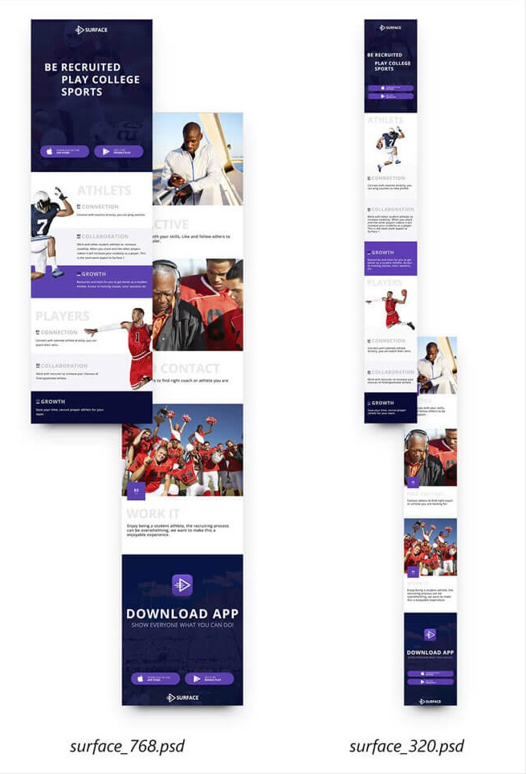

# Тестовый проект

**Проект реализован локально и опубликован на сервисе [GitHub pages](https://pages.github.com/). 

В рамках проекта я сверстал макет сайта для двух групп устройств: планшеты и смартфоны.

Макеты сайта для различных экранов выглядят так:

Исходные файлы макетов хранятся в директории [sources](./sources/) репозитория:

- `surface_768.psd` – макет для экрана шириной 768px,
- `surface_320.psd` – макет для экрана шириной 320px.

Также папка [sources](./sources/) содержит jpg-изображения – превью макетов для быстрого просмотра. **Не верстайте сайт с превью, используйте для верстки psd-макеты.**

В поддиректории [fonts](./sources/fonts/) вы можете найти использующиеся в макете шрифты, а в поддиректории [svg](./sources/svg/) — иконки в формате `svg`.

## Требования

#### Содержание
- [Кроссбраузерная верстка](#Кроссбраузерная-верстка)
- [Семантическое использование тегов](#Семантическое-использование-тегов)
- [Валидная верстка](#Валидная-верстка)
- [Соответствие верстки макету](#Соответствие-верстки-макету)
- [Реализация сетки](#Реализация-сетки)
- [Промежуточные состояния между макетами](#Промежуточные-состояния-между-макетами)
- [Оформление кода](#Оформление-кода)
- [Файловая структура проекта](#Файловая-структура-проекта)

### Кроссбраузерная верстка
В рамках проекта сверстанные макеты должны корректно отображаться на следующих типах устройств:
- компьютер с операционной системой Windows и Mac OS,
- планшеты и смартфоны с операционной системой iOS,
- планшеты и смартфоны с операционной системой Android.

Кроме поддержки основных типов устройств также требуется, чтобы верстка корректно работала в следующих браузерах:
- Последняя версия Google Chrome,
- Последняя версия Mozilla FireFox,
- Последняя версия Edge,
- Последняя версия Opera,
- Последняя версия Safari,
- Последняя версия Mobile Safari,
- Последняя версия Mobile Chrome.

### Семантическое использование тегов
В макетах проекта содержатся следующие элементы:
- Разделы,
- Заголовки,
- Ссылки,
- Изображения,
- Подписи,
- Абзацы.

Все эти элементы имеют специальные теги в стандарте HTML5, поэтому в рамках проекта мне было необходимо их использовать.

### Валидная верстка
После полной реализации верстки необходимо ее протестировать с помощью сервиса [W3C Markup Validation Service](https://validator.w3.org). В итоговом отчете не должно быть ошибок или предупреждений.

### Соответствие верстки макету
Итоговый проект должен быть копией макетов, предоставленных дизайнером. При реализации допускаются следующие отличия:
- толщина шрифта в браузерах и фотошопе,
- межсимвольное расстояние,
- различия в отступах — до 2px.

### Реализация сетки
Реализовать сетку страницы вам нужно при помощи `flexbox`. Запрещено использовать библиотеки, которые уже имеют готовые классы для сетки (например, Twitter Bootstrap, Zurb Foundation и другие).

Также запрещено использовать следующие способы решения задачи:
- таблицы,
- float-сетка,
- сетка с помощью `inline-block` элементов,
- CSS Grids.

### Оформление кода
Дипломный проект обязательно должен соответствовать принятому стилю кода для [HTML](https://github.com/netology-code/codestyle/tree/master/html) и [CSS](https://github.com/netology-code/codestyle/tree/master/css).

### Файловая структура проекта
Файловая структура проекта должна состоять из следующих элементов:
- `css` — папка, содержащая стили проекта,
- `fonts` — папка, содержащая шрифты проекта,
- `img` — папка, содержащая графику проекта,
- `index.html` — HTML-страница. 
